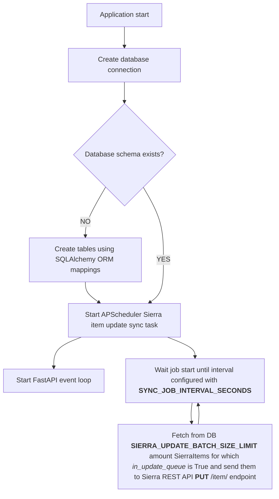

# Backend

The backend component provides REST API endpoints and manages the database for the Signum-savotta solution. It handles client registration, item data management, synchronization with Sierra LMS, and system state monitoring.

## Features

- **REST API:** FastAPI-based endpoints for item management, client registration, and system status.
- **Database Integration:** Uses SQLAlchemy for PostgreSQL database operations.
- **Periodic Synchronization:** Coordinates with the ETL component to keep item data up-to-date.
- **Client Management:** Supports API key registration and access control.
- **Error Reporting:** Integrated with Sentry for error tracking and diagnostics.
- **Configurable:** All connection and sync parameters are set via environment variables.

## Requirements

- Python 3.14+
- [APScheduler](https://apscheduler.readthedocs.io/)
- [FastAPI](https://fastapi.tiangolo.com/)
- [httpx](https://www.python-httpx.org/)
- [sentry-sdk](https://pypi.org/project/sentry-sdk/)
- [SQLAlchemy](https://www.sqlalchemy.org/)
- [Uvicorn](https://www.uvicorn.org/)

## Usage

Intended to be run using docker-compose locally (see repository root `/README.MD` for reference) or installed to a server.

## API Endpoints

- `/itemdata/` – Manage item records: **GET** with barcode to fetch item details, **PUT** with item_record_id to add to update queue
- `/status/` – Clients post periodically their status and receive backend status in response: **POST**
- `/sync/` – **GET** ETL job synchronization configuration and **POST** ETL job payload
- `/` - Swagger documentation
- `/redoc/` - Redoc documentation

## Application lifecycle

## Environment Variables

- `ENV` application runtime environment (local, PROD)
- `DB_HOST` Signum-savotta internal database host (URL without port)
- `DB_PORT` Signum-savotta internal database port
- `DB_USER` Signum-savotta internal database user
- `DB_PASSWORD` Signum-savotta internal database password
- `DB_NAME` Signum-savotta internal database name
- `FULL_SYNC_BATCH_SIZE` Sierra ETL Synchronization batch size
- `SIERRA_API_ENDPOINT` Sierra LMS REST API endpoint base URL
- `SIERRA_API_CLIENT_KEY` Sierra LMS REST API client key
- `SIERRA_API_CLIENT_SECRET` Sierra LMS REST API client secret
- `SIERRA_API_CLIENT_POOL_SIZE` HTTP Client pool size for Sierra LMS REST API connectivity
- `SIERRA_API_CLIENT_TIMEOUT_SECONDS` HTTP Client request timeout for Sierra LMS REST API connectivity
- `SIERRA_API_CLIENT_RETRIES` HTTP Client request retry count for Sierra LMS REST API connectivity
- `SIERRA_UPDATE_INTERVAL_SECONDS` Sierra LMS update interval
- `SIERRA_UPDATE_MISFIRE_GRACE_TIME_SECONDS` Sierra LMS update scheduling lateness leeway
- `SIERRA_UPDATE_BATCH_SIZE_LIMIT` Maximum number of Sierra LMS updates per update iteration
- `SIERRA_UPDATE_SET_INVDA` Boolean to control if INVDA field is updated in Sierra LMS for reclassified items
- `SIERRA_UPDATE_SET_IUSE3` Boolean to control if IUSE3 field is updated in Sierra LMS for reclassified items
- `LOG_LEVEL` log level according to Python logging (also controls Sentry log levels)
- `SENTRY_DSN` Sentry DSN
- `SENTRY_RELEASE` Sentry release identifier 

## License

MIT License

## Authors

- Mikko Vihonen (mikko.vihonen@nitor.com)

