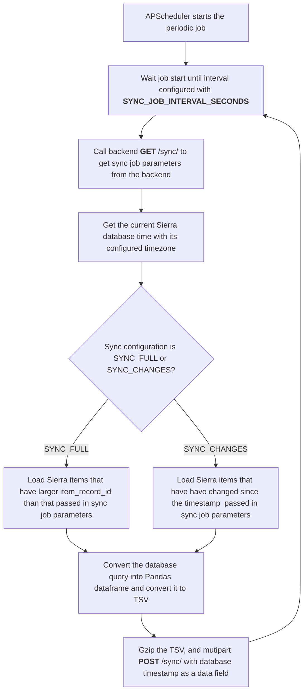

# ETL Component

The ETL component is responsible for periodically synchronizing Sierra LMS item data with the backend database for the Signum-savotta solution. It is stateless, and fetches configuration from the backend for each run.

## Features

- **Periodic Data Synchronization:** Fetches item data from Sierra LMS at configurable intervals.
- **REST API Integration:** Communicates with the backend via FastAPI endpoints.
- **Error Handling & Logging:** Robust error reporting and logging using Sentry and standard logging.
- **Configurable:** All connection and sync parameters are set via environment variables.

## Requirements

- Python 3.10+
- [FastAPI](https://fastapi.tiangolo.com/)
- [SQLAlchemy](https://www.sqlalchemy.org/)
- [APScheduler](https://apscheduler.readthedocs.io/)
- [Pandas](https://pandas.pydata.org/)
- [httpx](https://www.python-httpx.org/)
- [sentry-sdk](https://pypi.org/project/sentry-sdk/)
- [Uvicorn](https://www.uvicorn.org/)

## Usage

Intended to be run using docker-compose locally (see repository root `README.MD` for reference) or installed to a server.

## Periodic Data Synchronization Flow

## Environment Variables
- `ENV` application runtime environment (local, PROD)
- `DB_HOST` Sierra LMS database host (URL without port)
- `DB_PORT` Sierra LMS database port
- `DB_USER` Sierra LMS database user
- `DB_PASSWORD` Sierra LMS database password
- `DB_NAME` Sierra LMS database name
- `BACKEND_URL` Signum-savotta backend base URL
- `ETL_CLIENT_API_KEY` API key for ETL client for Signum-savotta backend access
- `MAX_SYNC_DELTA_MINUTES` Time limit for Sierra bib/item data changes (delta) updates
- `SYNC_JOB_INTERVAL_SECONDS` Sierra LMS bib/item data sync interval 
- `SYNC_JOB_MISFIRE_GRACE_TIME_SECONDS`  Sierra LMS bib/item data sync scheduling lateness leeway
- `LOG_LEVEL` log level according to Python logging (also controls Sentry log levels)
- `SENTRY_DSN` Sentry DSN
- `SENTRY_RELEASE` Sentry release identifier 

## License

MIT License

## Authors

- Mikko Vihonen (mikko.vihonen@nitor.com)